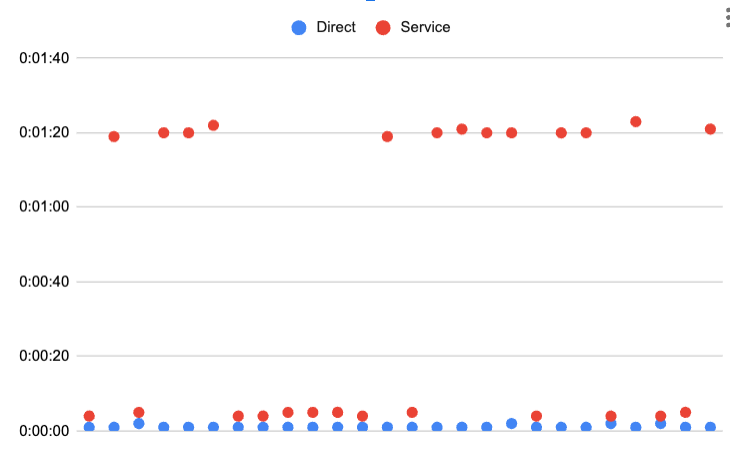

# Angry Beavers

Spoot!

I'm observing an [nginx app and service](./control/control-service.yaml) coming up within a few seconds, and the
health check endpoint showing in the logs:

```
10.244.0.1 - - [26/Jan/2024:13:11:58 +0000] "GET /ready HTTP/1.1" 200 4 "-" "kube-probe/1.27"
```

However, when curling from another pod to the service `control`, it takes a long time between the `curl` request and the first time the 
server observes the request. It finally logs:

```
10.244.0.113 - - [26/Jan/2024:13:12:05 +0000] "GET /info HTTP/1.1" 200 1424 "-" "curl/8.5.0"
```

# Run-local

[run-local](./run-local) executes this scenario with a local curl and port forward. So far, *this does not* evidence the issue.

# Run
[run](./run) executes this scenario with a service and a job that calls the service.


# Results

* run-local == Direct
* run == Service



